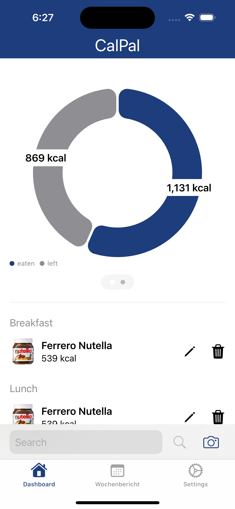
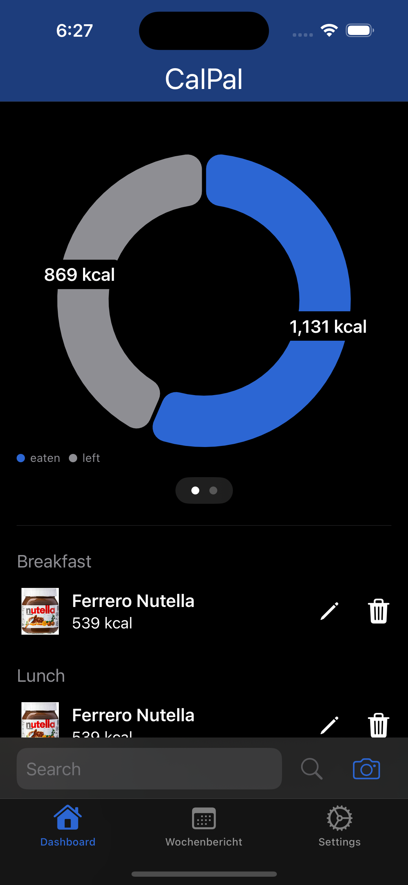
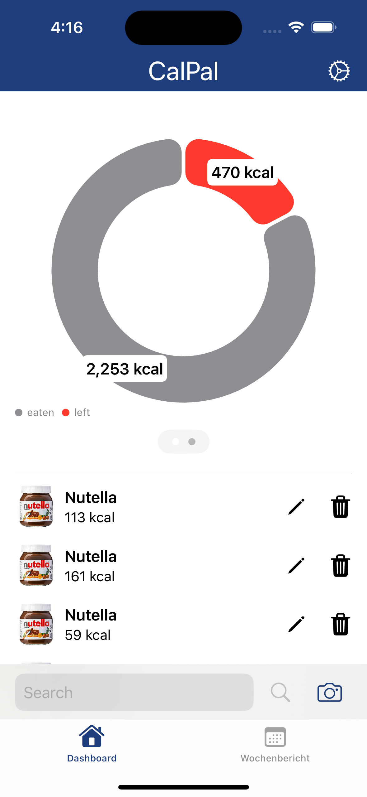
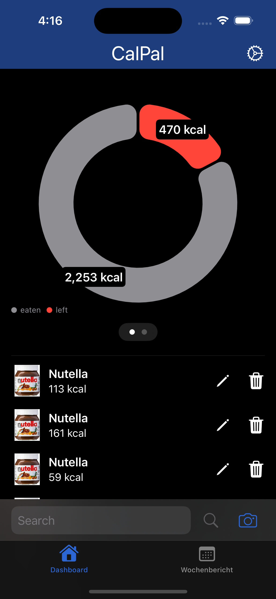
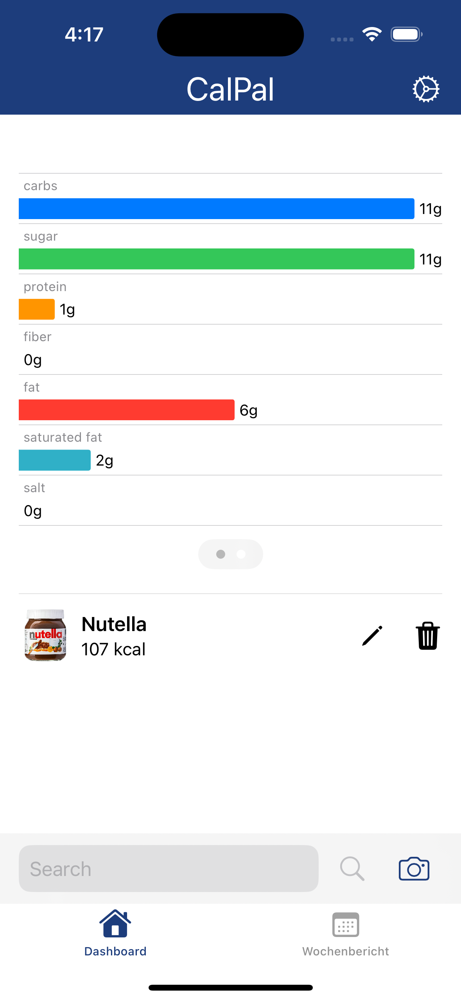
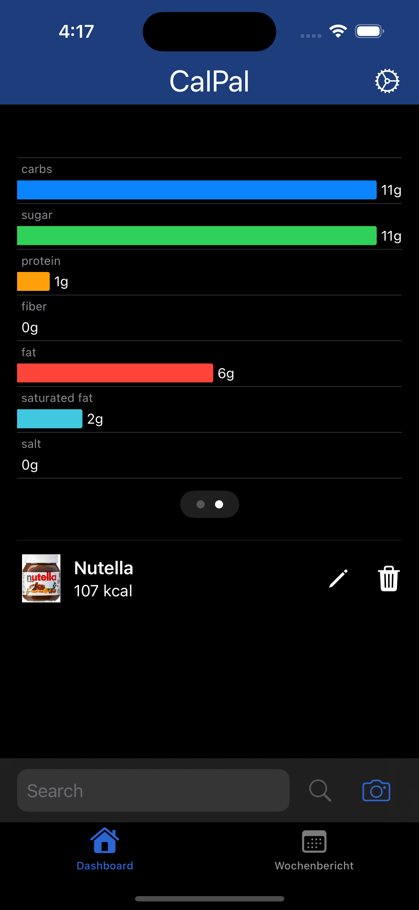

# CalPal
Willkommen in der Welt von CalPal - deiner ultimativen Kalorientracking-App für iOS! Wir präsentieren eine intelligente und benutzerfreundliche Anwendung, die dir hilft, deine Gesundheits- und Fitnessziele zu erreichen, indem sie dir dabei hilft, deine tägliche Kalorienaufnahme zu verfolgen und zu optimieren.

|||||
|--|--|--|--|
|Das Dashboard in normaler Darstellung|Das Dashboard in dunkler Darstellung|Das Dashboard in normaler Darstellung wenn das Kalorienziel überschritten wurde|Das Dashboard in dunkler Darstellung wenn das Kalorienziel überschritten wurde|

## Intuitives Tracking
CalPal bietet eine nahtlose Benutzererfahrung. Scanne einfach Barcodes von Lebensmitteln, wähle aus einer umfangreichen Datenbank oder füge Mahlzeiten manuell hinzu. Verfolge Kalorien, Makronährstoffe und mehr, um ein genaues Bild deiner Ernährung zu erhalten.

## Smarte Ziele
Deine individuellen Ziele stehen im Mittelpunkt. Gib deine Zielsetzungen ein - sei es Abnehmen, Muskelaufbau oder einfach eine gesündere Ernährung. CalPal erstellt daraufhin ein personalisiertes Kalorienziel für dich.

## Fortschrittliche Analysen
Erhalte tiefere Einblicke in deine Ernährungsgewohnheiten. Verfolge nicht nur Kalorien, sondern auch Nährstoffe wie Protein, Kohlenhydrate und Fett. Unsere App liefert dir visuelle Berichte und Diagramme, um deinen Fortschritt zu überwachen.
|||
|--|--|

## Lebe gesünder!
CalPal ist mehr als nur eine App - es ist dein treuer Begleiter auf dem Weg zu einem gesünderen Lebensstil. Egal, ob du abnehmen, Muskeln aufbauen oder einfach bewusster essen möchtest, CalPal bietet die Werkzeuge und Unterstützung, die du benötigst. Starte heute deine Reise zu einem fitteren und vitaleren Ich mit CalPal!

### Todo:
#### Generell:
- [ ] App Icon erstellen
- [ ] HealthKit Integration
- [ ] CloudKit Integration
- [ ] Widget
- [ ] Lokalisierung

#### Wochenbericht:
- [ ] Wöchentliche Zusammenfassung

### Ideen:
- [ ] Erinnerungen für Mahlzeiten
- [ ] Werbung oder Premiummodell

### Bugs:
